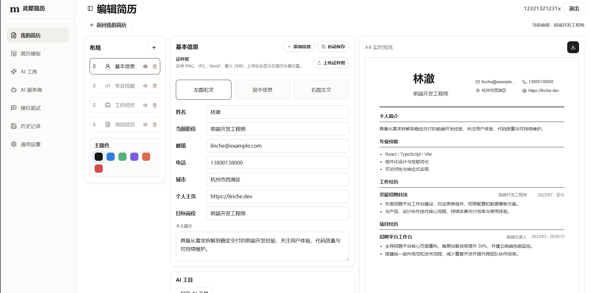

# 基于 AI 的智能简历优化与模拟面试平台

这是一个面向求职者的 AI 简历优化与模拟面试产品，视觉参考 Magic Resume 的简历编辑工作台，并扩展了真实 AI 简历诊断、简历优化、模拟面试、历史记录和后台管理模块。

## 界面展示

### 简历编辑器



## 技术栈

- React
- Vite
- CSS
- lucide-react
- MySQL SQL 脚本

## 运行方式

```bash
pnpm install
pnpm dev
```

浏览器访问终端输出的本地地址。

## 后端接口

项目已内置一个轻量 Node.js API 服务，开发阶段使用本地 JSON 文件持久化数据，不需要额外安装依赖。

```bash
pnpm dev:api
```

默认地址：

```text
http://127.0.0.1:8787
```

## AI 配置

AI 诊断、润色、语法检查和面试反馈会调用真实 OpenAI 兼容接口。没有配置 API Key 时接口会返回明确错误，不会用本地规则冒充 AI 结果。

推荐使用环境变量：

```bash
OPENAI_API_KEY=你的_api_key
OPENAI_BASE_URL=https://api.openai.com/v1
OPENAI_MODEL=gpt-5.5
pnpm dev:api
```

也可以在页面的「AI 服务商」中保存 `Base URL`、`模型 ID` 和 `API Key`。后端不会把完整 API Key 返回给前端。

常用接口：

- `GET /api/health`：服务健康检查
- `GET /api/ai-config`：读取 AI 配置状态
- `PUT /api/ai-config`：保存 AI 服务商、Base URL、模型 ID 和 API Key
- `POST /api/auth/login`：用户登录。首次使用请通过注册页创建账号；项目不再提供默认弱密码账号。
- `POST /api/auth/register`：用户注册
- `GET /api/job-positions`：岗位方向列表
- `GET /api/resumes`：简历列表
- `GET /api/resumes/:id`：简历详情
- `POST /api/resumes/:id/analyze`：生成 AI 简历诊断记录
- `POST /api/resumes/:id/optimize`：生成 AI 润色记录
- `POST /api/resumes/:id/grammar-check`：生成 AI 语法检查记录
- `GET /api/resumes/:id/history`：简历版本历史
- `POST /api/interviews`：创建模拟面试
- `POST /api/interviews/:id/answers`：提交面试回答并生成反馈
- `GET /api/admin/overview`：后台统计概览

### 岗位知识库（阶段 4，ADMIN 专用）

知识库当前仅支持管理员以文本方式录入可追溯的岗位资料；普通用户不能浏览或调用管理接口。资料可使用 Markdown、中文序号、阿拉伯数字、`一、` 和 `【标题】`。服务端只进行换行/空白规范化、章节识别和语义优先切片，不调用 AI 改写原文。

- `GET/POST /api/admin/knowledge-documents`：筛选或创建资料
- `GET/PUT/DELETE /api/admin/knowledge-documents/:id`：查看、编辑或级联删除资料
- `POST /api/admin/knowledge-documents/:id/process`：生成或重用当前资料的 chunks
- `GET /api/admin/knowledge-documents/:id/chunks`：查看当前有效 chunks
- `GET /api/admin/knowledge-documents/:id/processing-records`：查看不可覆写的处理历史
- `GET /api/admin/knowledge-chunks/:chunkId`：查看单个 chunk

相同 `rawTextHash` 和处理策略会直接返回既有成功结果；新处理只有成功后才替换当前 chunks，失败会保留上一次成功结果。`tokenEstimate` 使用文档化的字符/词近似算法，不等同于模型真实 token 数。阶段 4 不包含文件上传、PDF/DOCX/网页解析、Embedding、向量检索或 RAG。

### 基础岗位匹配（阶段 3）

岗位匹配基于用户显式选择的 ResumeVersion 和已成功解析、仍有效的 JD。创建 JobApplication 时必须同时提交 `resumeId`、`resumeVersionId` 和 `jobDescriptionId`；不会以“当前简历”“最近版本”或“最新 JD”补全输入。

- `POST /api/job-applications/:id/matches`：为已锁定的申请创建一次新的基础匹配报告
- `GET /api/job-applications/:id/matches`：读取该申请的匹配历史摘要
- `GET /api/resume-job-matches/:matchId`：读取完整六维报告
- `POST /api/resume-job-matches/:matchId/retry`：只重试失败记录，且产生新的历史记录

报告的六个固定权重为：必备技能 30、项目相关性 25、关键词覆盖 15、经验 10、教育背景 10、表达质量 10。AI 只负责语义判断、双方证据与解释；后端验证证据后重新计算总分，绝不直接采用模型返回的总分。简历中没有证据时，界面和记录统一使用“当前简历中未找到相关证据”，不推断用户是否具备该能力。

匹配提示仅发送去隐私的 `buildAiResumeContext` 和锁定的 JD 材料；姓名、邮箱、电话、网站、照片、Session、API Key 和无关个人资料不会发送给第三方 AI。匹配不会修改简历，也不会覆盖历史报告。

## 数据库
开发运行时使用 `backend/data/store.json`；`database.sql` 是生产 MySQL 的结构与增量迁移参考，不会被 Node 服务在本地自动执行。文件末尾的“Incremental production migration reference”只包含非破坏性迁移建议，执行前应先备份并按目标 MySQL 版本检查列/索引是否已存在。

`database.sql` 包含课程设计所需的 MySQL 建库、建表和示例数据。

核心表包括：

- `user`
- `resume`
- `education_experience`
- `work_experience`
- `project_experience`
- `skill`
- `job_position`
- `resume_analysis_record`
- `resume_optimize_record`
- `interview_question`
- `mock_interview`
- `interview_answer`
- `system_notice`

## 页面模块

## 阶段 5A：向量索引（ADMIN，已通过最终验收）

阶段 5A 只为已处理的岗位知识 Chunk 建立、重建、删除和审计向量索引，不提供任何搜索或 RAG。复制 `.env.example` 后仅在服务端配置 Embedding/Qdrant 变量；本地可执行 `docker compose -f docker-compose.qdrant.yml up -d` 启动仅绑定 `127.0.0.1:6333` 的 Qdrant。密钥不得写入仓库或 JSON 数据。Docker 可用时运行 `corepack pnpm test:qdrant`。

阶段 5B 已完成真实 Qdrant 复验，全部发布门禁通过：ADMIN 可使用关键词、向量或混合检索实验室，检索只返回本地可验证的当前有效 Chunk。RRF 是默认融合策略；Reranker 默认关闭，失败回退 RRF。允许合并 master 并创建 `rag-stage-5b-passed` 标签（本轮未执行）。`corepack pnpm test:qdrant-retrieval` 是独立真实 Qdrant 检索 smoke。

- 首页仪表盘
- 简历工作台
- AI 简历诊断
- AI 简历优化
- 模拟面试
- 历史记录
- 管理后台
