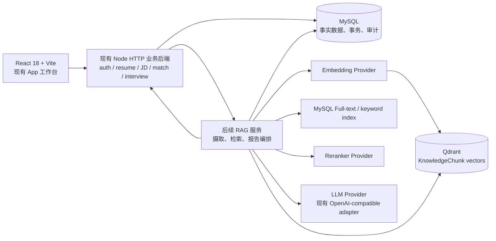

# RAG 升级架构

## 架构原则

保持现有 React 18 + Vite、Node 原生 HTTP API 和业务页面；RAG 是一个可替换的内部服务边界，而不是把向量查询、Embedding 或 Agent 提示词塞入 `src/App.jsx` 或 `backend/server.js`。现有 JSON 存储只服务迁移期/本地开发；可检索、可审计的生产数据以 MySQL 为事实源，Qdrant 只存可重建的向量索引。

## 模块职责与调用关系

| 模块 | 职责 | 不承担的职责 |
| --- | --- | --- |
| 现有 React 前端 | 登录态下选择 `resumeId`、编辑简历、粘贴 JD、展示任务/报告/引用、让用户接受或拒绝建议。 | 不持有 Provider 密钥；不计算向量；不信任 localStorage 作为事实源。 |
| 现有业务后端 | 已有 Cookie Session/角色控制；Resume、JobDescription、Application、Suggestion、Interview 的 REST API；校验所有 owner/ID；创建持久任务和版本。 | 不直接在请求线程完成大规模切片、Embedding 或索引重建。 |
| 后续 RAG 服务 | 文档摄取、清洗、分块、元数据、Embedding 任务、Hybrid retrieval、rerank、上下文组装、引用校验、报告/面试/Agent 编排。每次运行写 trace。 | 不直接接受浏览器身份断言；不拥有用户业务数据的唯一来源。 |
| MySQL | 用户、简历及不可变版本、JD 与解析、申请、匹配、建议、知识源/块、检索记录、面试、Agent 执行、任务、审计。 | 不作为向量 ANN 主索引。 |
| Qdrant | `knowledge_chunks` 对应的 embedding vector 和最低限度 payload（chunk/version/metadata/filter）。可由 MySQL 重建。 | 不保存用户密码、API Key、原始 JD/简历全量或唯一审计记录。 |
| Embedding Provider | 使用固定模型把 approved chunk/query 映射为向量；记录 model/dimension/version。 | 决定最终排序或生成文案。 |
| Reranker Provider | 对 keyword+vector 的候选集合重新排序，返回相关性分数/模型版本。 | 取代安全过滤、租户过滤或引用校验。 |
| 大模型 Provider | 复用当前 `runAiJson` 的 OpenAI-compatible 抽象，执行 JD 解析、报告/建议/问题生成；必须 schema 输出。 | 自行检索、悄悄补造证据或直接写入用户简历。 |

## 同步与异步边界

- 同步：身份鉴别、Resume/JD 保存、基础匹配、读取已有报告/记录、建议接受/拒绝。
- 异步：JD 解析（可短任务同步但仍需可重试）、知识摄取、chunk embedding、Qdrant upsert/rebuild、RAG 报告、复杂面试/Agent。请求立刻返回 `taskId`，前端轮询/订阅任务状态。
- 事务：MySQL 先提交业务对象和 outbox/task，再由 worker 处理 Qdrant；禁止先写 Qdrant 再把它当作成功事实。

## 现有可复用点与拆分方向

`backend/server.js` 已有 `requireUser`、`getOwnedResume`、原子 JSON 写入、`runAiJson`、schema 约束和 AI provider 配置。它可先承载新的 REST 边界；当 RAG 规模增加，再把 parser/retrieval/orchestrator 移到 `backend/rag/*` 或独立服务，保持 API 契约不变。

`src/App.jsx` 目前约 2976 行，集中路由、API、全部页面和编辑器状态；`src/styles.css` 约 4954 行，集中产品与模板样式。阶段 1 只抽出 resume selection/data client，阶段 2-8 按 JD、Match、Knowledge、Interview 页面渐进拆分，避免重写。

## 安全与数据边界

- 每条 user-owned 资源由后端从 Session 取 user，不能使用浏览器提供的 `userId`。
- 检索 metadata 必须在向量查询前按 `tenantScope/status/language/role` 过滤；用户 JD 和私人简历默认不进入公共知识库 collection。
- Provider 密钥继续仅存环境变量或现有服务端受限配置；RAG trace 只存 hash/标识，不保存密钥和完整私密 prompt。
- 报告引用使用稳定 `knowledgeChunkId`；当来源撤回/禁用，引用会失效并触发报告失效或重生成。
