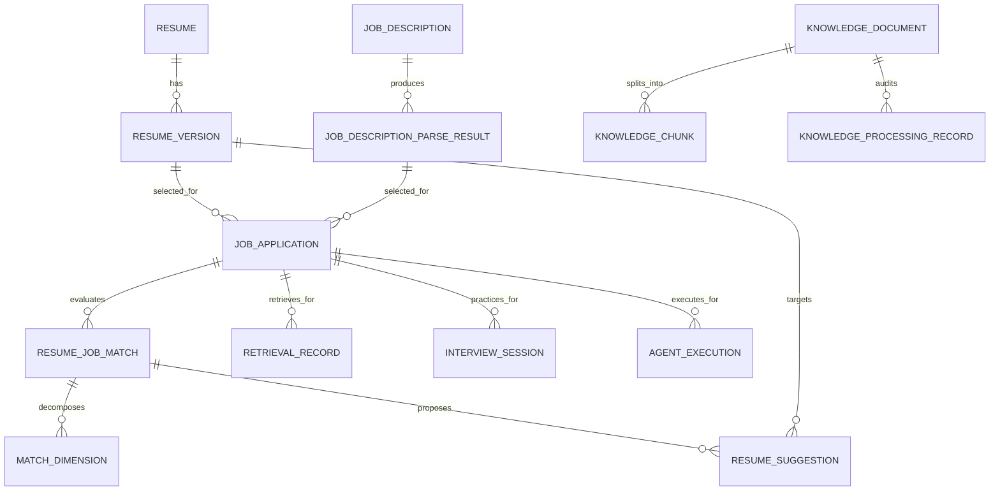

# RAG 核心数据模型

## 当前模型与目标模型的衔接

当前 JSON `resumes` 已保存 `id/userId/title/currentPosition/targetPosition/targetPositionId/realName/email/phone/city/website/selfEvaluation/themeColor/templateName/templateLayout/photoDataUrl/sectionContent/sectionDetails/profileFields/visibleSections/customSections/moduleOrder/version/updatedAt` 等字段。`sectionDetails` 的每条经历已有稳定 `id`、`name`、`role`、`startDate`、`endDate`、`isCurrent`、`highlights`。这是建议定位和版本差异的最佳基础。

当前 `resumeHistories` 不含 snapshot，当前 `analysisRecords`、`optimizeRecords`、`grammarRecords` 不含 `resumeVersionId`。以下是 MySQL 的目标模型；JSON 阶段先用同名对象/字段兼容，再迁移。所有时间使用 UTC，所有大模型/检索输出都保存 `schemaVersion` 和 provider/model 版本。

## 核心实体

| 实体 | 主键与关键外键 | 关键字段 | 约束/用途 |
| --- | --- | --- | --- |
| Resume | `id`; `user_id -> user.id` | title、current_position、contact JSON/列、target_position_text、template、module JSON、`current_version_id` | 用户简历聚合根；保留编辑器现有字段，不把 JD 当作 resume 字段。 |
| ResumeVersion | `id`; `resume_id -> Resume.id` | version_no、`snapshot_json`、`normalized_text`、`content_hash`、source、summary、created_at | `(resume_id, version_no)` 唯一；每次用户保存和建议应用生成不可变完整快照。 |
| JobDescription | `id`; `user_id -> user.id` | title、company_name、source_url、`raw_text`、`normalized_text`、status、current_parse_id、content_hash | 用户真实粘贴 JD 的聚合根；保存原文、不能只留岗位名。 |
| JobDescriptionParseResult | `id`; `job_description_id` | parser_version、status、structured_json、requirements JSON、source_spans JSON、confidence、model/provider、input_hash | 同一 JD 可多次解析；`raw_text` 改变后不得覆盖旧结果。 |
| JobApplication | `id`; `user_id/resume_id/resume_version_id/job_description_id/job_description_parse_result_id` | `resume_version`、`resume_content_hash`、`job_description_raw_text_hash`、status、created_at | 固化“一版简历申请一版 JD”的业务上下文；阶段 3 必须显式选择 `resumeVersionId`，不能推断当前版本。 |
| ResumeJobMatch | `id`; `job_application_id` | 输入绑定、algorithm_version、六维报告、total_score、status、provider/model、failure code/message、created/updated_at | 一次基础匹配执行；与 Application 的版本绑定，不能漂移到当前简历，失败不复用旧成功报告。 |
| MatchDimension | `id`; `match_id` | code、label、weight、score、status、resume_evidence JSON、jd_evidence JSON、rationale | 如 hard_requirements、skills、experience、impact、education、keywords；总分可重算。 |
| ResumeSuggestion | `id`; `match_id/resume_version_id` | target_path、target_entry_id、before_json、after_json、reason、citations JSON、status、decision_reason、applied_version_id | 状态：PENDING/ACCEPTED/REJECTED/STALE/FAILED；不能自动改 Resume。 |
| KnowledgeDocument | `id`; `created_by -> user.id` | title、description、source_type/name/url、document_type、job_family、seniority、skill_tags、language、raw_text/hash、normalized_text、status、processing_version、chunk_count、failure | 阶段 4 JSON 实体；状态 DRAFT/PROCESSING/PROCESSED/FAILED，原文变更标记重处理。 |
| KnowledgeChunk | `id`; `document_id -> KnowledgeDocument.id` | chunk_index、heading_path、title、content/hash、token_estimate、normalized-text offsets、来源元数据、processing_version、created_at | 只由服务端生成；成功新版本才替换当前文档 chunks，`tokenEstimate` 是明确近似值而非模型 token。 |
| KnowledgeProcessingRecord | `id`; `document_id -> KnowledgeDocument.id` | processing_version、status、input_hash、chunk_count、strategy、failure、created/completed_at | 处理审计不可覆盖；相同输入 hash 与策略幂等返回，失败保留上一版成功 chunks。 |
| RetrievalRecord | `id`; `job_application_id` 可空，`agent_execution_id` 可空 | purpose、query_text/hash、filters JSON、candidate JSON、selected JSON、fusion/rerank config、latency、status | 保存关键词/向量/Reranker 候选、分数和最终引用，便于调试和评估。 |
| InterviewSession | `id`; `job_application_id/resume_version_id/resume_job_match_id` | target_role snapshot、question_plan JSON、status、report JSON、provider/model、created/completed_at | 取代当前仅 `resumeId/positionId/targetPosition` 绑定；问题/答案可沿用现有 mock interview/answer 表并增外键。 |
| AgentExecution | `id`; `user_id/job_application_id` | agent_type、status、input_hash、plan JSON、step_count、max_steps、token/cost/latency、result_ref、failure_code | 固定上限状态机的完整审计；不保存隐藏思维链，只存工具输入输出摘要和 trace IDs。 |

## 建议的关系



## 文本规范化与快照

`ResumeVersion.normalized_text` 不是 UI 的唯一来源。它由 `snapshot_json` 按稳定顺序展开：基本信息（过滤不参与匹配的敏感字段）→个人简介→技能→每个工作/项目条目的名称、角色、日期、高亮→自定义段。保存时计算 SHA-256 `content_hash`。JD 同样保存原文、清洗文本和 hash。所有解析、匹配、检索、生成记录必须写入它们所使用的 hash。

## MySQL 增量设计原则

1. 不执行当前 `database.sql` 顶部的 `DROP TABLE` 作为迁移；新增独立 migration 文件并先备份。
2. 已有 `resume`、`resume_version_history`、`job_position`、各类 AI record、`mock_interview` 可保留。`job_position` 是管理员维护的参考岗位方向，不能冒充用户 JD。
3. 先为旧记录回填 `resume_id`；`resume_version_id` 无法可靠推断时保持 NULL，并标记 `legacy_unversioned=true`，不能伪造关联。
4. 建立常用索引：`(user_id, updated_at)`、`(resume_id, version_no)`、`(job_description_id, created_at)`、`(job_application_id, created_at)`、`(match_id, code)`、`(document_id, status, version)`。
5. 对 user-owned 表的访问一律通过 owner/application/resume 反查；数据库外键帮助一致性，但授权仍由后端执行。

## Qdrant collection 约定

建议一个受控知识库 collection，例如 `lingxi_knowledge_v1`。point ID 可由 `knowledge_chunk.id + embedding_model_version` 确定；payload 至少有：

```json
{
  "knowledgeChunkId": 123,
  "knowledgeDocumentId": 12,
  "documentVersion": 3,
  "status": "APPROVED",
  "documentType": "STAR_CASE",
  "roles": ["frontend"],
  "skills": ["React", "TypeScript"],
  "language": "zh-CN",
  "embeddingModel": "provider/model@version",
  "contentHash": "sha256..."
}
```

Qdrant payload 不放原始 Resume/JD、用户联系方式、API Key 或唯一业务状态。删除/禁用 document 时由异步任务删除或过滤对应 vector；MySQL `KnowledgeChunk.status` 始终是最终授权判断。

## 阶段 5A 索引元数据

`KnowledgeIndexRun` 保存 document/version/input hash、Embedding Profile、Collection、各步骤计数、cleanup 与失败审计。`KnowledgeVectorRecord` 保存 Point ID、Chunk 与 run 的关联、输入 hash、profile、Collection 和 ACTIVE/STALE/PENDING_DELETE 状态；不保存向量数组。Document 摘要保存 `activeIndexRunId`、`vectorStatus`、已索引版本/数量/Profile/Collection/时间和安全失败摘要。后续检索必须以 `activeIndexRunId` 校验 Point payload。

## 阶段 5B 检索运行

`KnowledgeRetrievalRun` 保存 query hash、规范化查询、模式、服务端过滤、Profile/Collection、两路候选数、融合/返回数、Reranker 与降级状态、非敏感失败码、耗时和创建人。它不保存向量、密钥、完整外部请求或用户简历/JD；结果正文总是由本地当前 `KnowledgeChunk` 再读取并复核。

## 当前 AI 历史的保留策略

- `analysisRecords`：保留已有总分和建议，新增 `legacy=true`；新的基础/RAG 匹配使用 ResumeJobMatch，不混写。
- `optimizeRecords`、`grammarRecords`：保留为 editor action audit；新记录补 `resumeVersionId`、`targetPath`（如有）、`inputHash`。
- `mockInterviews`、`interviewAnswers`：继续展示历史；新 InterviewSession 绑定 JobApplication/Match，答案增加来源检索记录引用。
- 任何新的报告、建议、Agent 运行都不可只以 `targetPosition` 文本或 `current` 语义关联。
