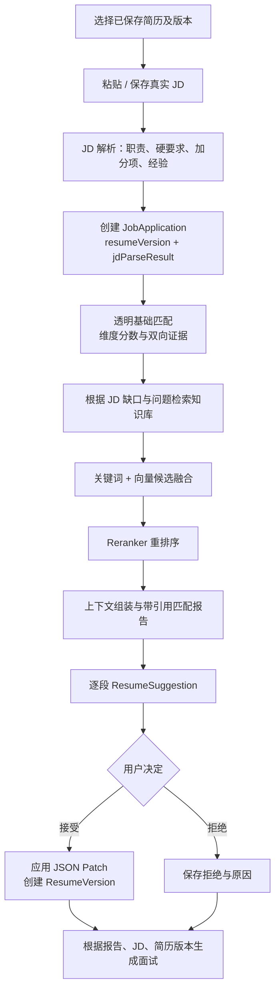
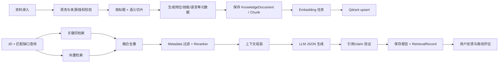

# RAG 业务与数据管道

## 用户业务链路



### 关键业务规则

1. 入口必须选择 `resumeId`；执行时锁定 `resumeVersionId`，不得取最近更新的 `current`。
2. JD 保存原文后才允许解析；解析结果可由用户确认/修订，并且每条字段保留 JD 片段位置。
3. JobApplication 是“某版简历对某版 JD”的稳定连接。匹配、报告、建议、面试只能关联它。
4. 基础匹配先于 RAG：硬条件、经验、技能和项目结果用规则/结构化证据给出可复算结果；RAG 只补充岗位知识、案例框架和表达建议。
5. 建议必须落到 `sectionDetails.<section>.<entry id>` 等稳定路径。用户接受时使用 base version 并生成新版本；拒绝不改变文本。

## 知识库 RAG 数据链路



## 摄取细则

- 资料类型限定为：岗位技能定义、行业/岗位要求、经过授权的优秀简历案例、STAR 表达指南、面试题与评分 rubric。每条必须有来源、作者/许可、管理员、状态。
- 清洗只删除 HTML 噪声、重复空白和明显导航内容，保留标题路径、列表和原文偏移。不要由 LLM 改写事实后再索引。
- 切片先按 H1/H2/H3、列表/段落边界，再在 token 上限内合并；保留小重叠且不跨越不相关标题。`chunk_index + content_hash` 确保可重跑。
- 先写 MySQL DRAFT chunk，再 Embedding，再 Qdrant upsert；向量成功后置 READY。失败可重试、不会发布半成品。

## 在线检索细则

1. 查询由 application 的 JD parse、基础匹配缺口、用户请求类型组合；不得把整份含个人信息的简历作为公共检索 query 无筛选发送。
2. 先过滤 `APPROVED`、语言、岗位、技能、文档类型、租户范围；安全过滤在查询之前，不能依赖 Reranker。
3. 关键词路径：MySQL Full-text/BM25（中文可采用已选分词实现）；向量路径：Qdrant top-k。使用版本化的 reciprocal rank fusion 或显式加权融合。
4. 对融合后的受限候选调用 Reranker；保存候选、各阶段 score、模型、延迟、被过滤原因到 RetrievalRecord。
5. 组装上下文要有 token 上限、每个 document 上限与去重；向模型传递引用 ID，不传“无来源事实”。
6. LLM 必须返回结构化 claim/citation 对；验证 citation ID 属于本次 final retrieval，且文档仍 APPROVED。无法验证的 claim 删除或标为无依据建议。

## RAG 输出契约（示例）

```json
{
  "summary": "候选人匹配…",
  "claims": [
    {
      "dimension": "skills",
      "statement": "建议将已有的性能优化成果按 STAR 结构展开。",
      "citations": ["kc_102", "kc_118"],
      "evidenceType": "knowledge_guidance"
    }
  ],
  "suggestions": [
    {
      "targetEntryId": "项目经历-…",
      "before": {"highlights": ["…"]},
      "after": {"highlights": ["…"]},
      "citations": ["kc_102"],
      "requiresUserConfirmation": true
    }
  ]
}
```

这不是模型可以自行决定的自由格式。服务端须对 target path、引用集合、字符串长度、事实保留和版本 hash 验证。

## 有限步骤 Agentic RAG

Agent 只在阶段 9 开启以下固定状态机：`VALIDATE_INPUT → PLAN (最多 1) → RETRIEVE (最多 2) → RERANK → GENERATE → VERIFY_CITATIONS → PERSIST → DONE/FAILED`。每步有超时、最大 token、最大候选数和 allowlist 工具；任何写简历行为只产生 PENDING suggestion，应用仍需用户确认。`AgentExecution` 记录步骤摘要、参数 hash、工具结果引用和失败原因，不暴露或保存隐藏推理。
